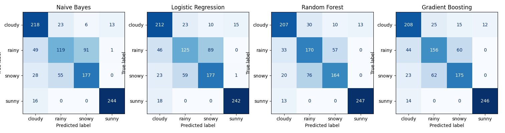
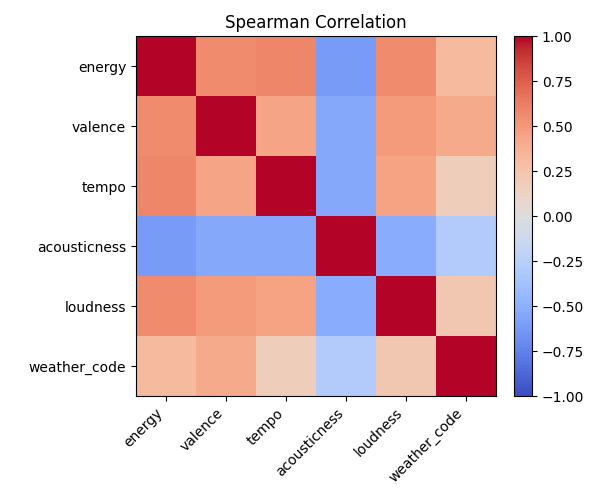

# Weather-Conditioned Music Classification Engine

Predict a suitable weather category given a user-inputted song.

## Tech Stack
- Backend: Python - scikit-learn, pandas, matplotlib, FastAPI (served via Uvicorn)
- Frontend: React, Typescript, Tailwind CSS

## Project Structure

```text
.
├── backend
│   ├── api
│   ├── app
│   └── models
├── data
├── frontend
│   ├── public
│   └── src
├── ml
│   └── results
├── README.md
└── requirements.txt
```

## APIs Used
- Spotify Web API (song lookup)
- ReccoBeats API (audio features)
- OpenWeatherMap API (real-time weather context) - NOT USED CURRENTLY

## ML Component

- Data source: `data/track_data.csv`. We ultimately used 5201 labelled tracks for training/testing, around a third of which were pulled from Spotify-generated and user-made playlists using the Spotify Web API. Fetching the rest of the data was a challenge, as no canonical dataset mapping songs to weather labels exists. We thus decided that since weather labels are **weakly supervised**, it was appropriate to prompt LLMS (ChatGPT and Anthropic) for supplemental data based on **qualitative heuristics** (e.g. "melancholic and reflective ambiance" -> `rainy`).
- Features: `energy`, `valence`, `tempo`, `acousticness`, `loudness`. `StandardScalar` was used to standardize each feature.
- Target label: `weather`: one of `sunny`, `cloudy`, `rainy`, `snowy`.
- Models in `ml/models.py`, trained using `Pipeline` to avoid data leakage: Naive Bayes, Logistic Regression (baseline), Random Forest, Gradient Boosting (production).

Training and evaluation scripts:

```bash
python ml/train.py
python ml/evaluate.py
```

Evaluation metrics and diagnostics used in `ml/evaluate.py`:

- Weighted F1 on a simple holdout split was initially used, and we later enhanced by using Stratified K-Fold cross-validation with weighted F1
- Permutation feature importance (PFI)
- Confusion matrices (visualized using matplotlib)



- Spearman correlation heatmap (visualized using matplotlib)



See `ml/results/evaluate_results.txt` for detailed final diagnostics

### Conclusion

We found that `energy`, `valence`, `tempo`, `acousticness`, `loudness`, standardized using `StandardScalar`, were a set of features with consistent, moderately high PFI scores across multiple CV folds and all four models. A healthy imbalance was present, with slightly weaker supporting features such as tempo (mean 0.113) complementing stronger features such as 'energy' (mean 0.224). We ultimately achieved **0.758 ± 0.014** weighted F1 with 5-fold stratified cross-validation on our Gradient Boosting production model. 

We initially intended for the Naive Bayes model to be a deliberately weak baseline, having assumed that audio features should be highly correlated and conditionally dependent. However we ended up with a surprisingly high **0.745 CV F1**. Indeed, in our regime, where features tend to cluster around the chosen classes and predictive signal is distributed relatively evenly - PFI scores shows no feature dominates completely, and Spearman correlation coefficients are contained in the relatively moderate range **[-0.62, 0.58]** - Naive Bayes can still effectively aggregate signals. 

More expressive models such as Gradient Boosting are nonetheless able to achieve additional gains by modeling residual feature dependencies. For instance, Naive Bayes struggled on differentiating between the similar classes of `snowy` and `rainy`, but Gradient Boosting reduced from **146 to 59** such misclassifications.

## Demo Paths

[Video Demo](https://drive.google.com/file/d/1nc7trHjiscxEsSmc9bRy0GR-1T8RSImB/view?usp=sharing)

### Option 1: Run the Website Locally

This starts the FastAPI backend + the Vite frontend.

1. Backend setup:

```bash
python -m venv venv
source venv/bin/activate
pip install -r requirements.txt
```

2. Set Spotify credentials (go to Spotify Web API):

```bash
export SPOTIPY_CLIENT_ID="your_spotify_client_id"
export SPOTIPY_CLIENT_SECRET="your_spotify_client_secret"
```

3. Start the API (uses `backend/models/model.pkl` if present):

```bash
uvicorn backend.app.main:app --reload --port 8000
```

4. Start the frontend in a second terminal:

```bash
cd frontend
npm install
npm run dev
```

5. Open the app using the given `localhost` server.

### Option 2: Manual Features via the ML Script

This runs a simple prompt-driven predictor and does not use the web app.

1. Ensure the Python environment is ready (same as Demo 1).
2. Run the script and enter features when prompted:

```bash
python 'ml/features->weather.py'
```

The user will be prompted for `energy [0.0, 1.0]`, `valence [0.0, 1.0]`, `tempo (BPM)`, `acousticness [0.0, 1.0]`, and `loudness (dB)` in order, and the predicted weather category is printed.

## Notes/Possible Improvements

- As of Nov. 2024, Spotify API does not provide access to audio features. ReccoBeats was thus added for audio features but API experienced high latency. In the future we can experiment with caching song information for faster response times.
- In the future, sentiment/semantic analysis on song lyrics could be used to further our model. For example, our model classifies "Jingle Bell Rock" by Brenda Lee as `sunny`, but the lyrics are definitely more indicative of a `snowy` song. 
